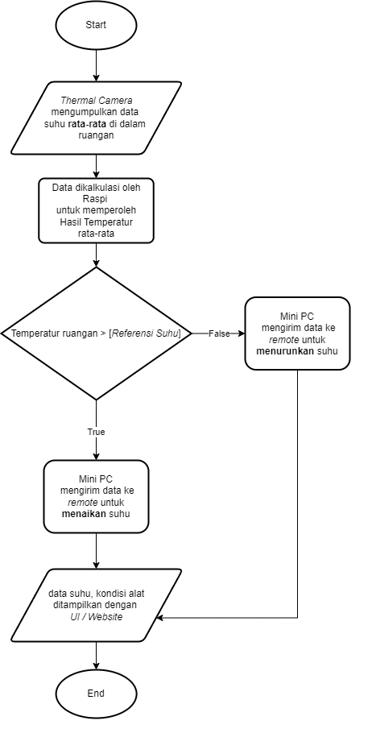

# Thermal Camera HVAC

> PLC SCSL Laboratory Project Base Learning

### Diagram Plan

Here's the diagram that i made

In this diagram, there are three important components for building this project. Firstly, a thermal camera is used to measure people's temperature in the laboratory. Secondly, a mini PC is utilized to control and calculate the temperature obtained from the camera. Lastly, a universal remote control is employed to adjust or regulate the airflow emitted by the AC.

### Flowchart

So, this is a simple explanation about the flowchart. In this flowchart diagram, it starts with the thermal camera measuring people's temperature, and then the temperature data is controlled and calculated by the mini PC. When the people's temperature exceeds the reference temperature, the universal remote will increase the airflow from the AC. Conversely, when the people's temperature falls below the reference temperature, the universal remote control will decrease the airflow from the AC.

### Electrical Architecture

### Communication Architecture

### reference that i collected from internet

- https://learn.adafruit.com/adafruit-amg8833-8x8-thermal-camera-sensor

- https://how2electronics.com/diy-thermal-camera-with-raspberry-pi-amg8833-sensor/

- https://github.com/adafruit/Adafruit_AMG88xx_python

- https://learn.adafruit.com/adafruit-amg8833-8x8-thermal-camera-sensor

- https://how2electronics.com/diy-thermal-camera-with-raspberry-pi-amg8833-sensor/

- https://github.com/adafruit/Adafruit_AMG88xx_python

- https://www.youtube.com/watch?v=piVV-5RuX2o

- https://github.com/makerportal/AMG8833_IR_cam

- https://github.com/makerportal

- https://www.youtube.com/watch?v=uFoUAPQBCNY

- https://www.rgmvision.com/infrared-computer-vision/

- Acsess webinar here [here](https://www.youtube.com/watch?v=0o2d46kyR1Q)

- For source code [here](https://pyimagesearch.com/2022/10/10/introduction-to-infrared-vision-near-vs-mid-far-infrared-images/)

- PyImage Search [here](https://pyimagesearch.com/2022/10/24/thermal-vision-fever-detector-with-python-and-opencv-starter-project/)

---

### RAB

follow this [link](https://docs.google.com/spreadsheets/d/1vpriAi5HHOCgwNC7Mt6s1HICf34Qzx8J2fEp0PEnn2U/edit#gid=0)
