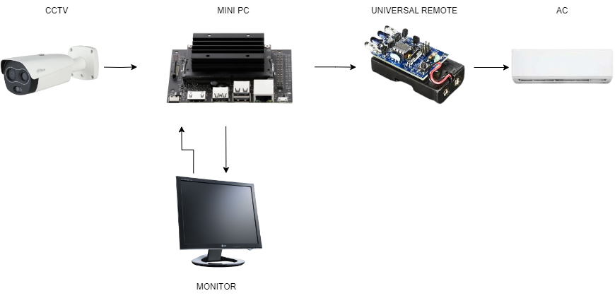
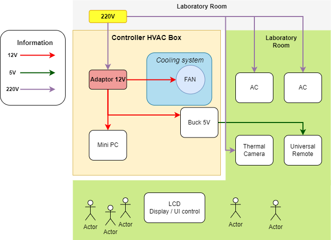
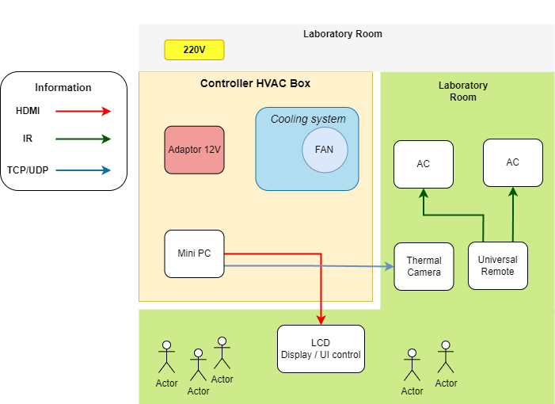
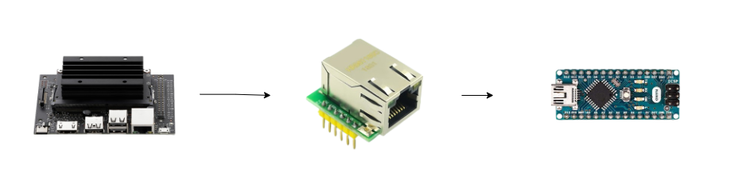

# Thermal CCTV HVAC

PLC SCSL Laboratory Project Base Learning [report](https://itsacid-my.sharepoint.com/:w:/g/personal/2040221004_student_its_ac_id/EbupkjB1esBMlMnZHS9zQ2QBUzxRnBv61q4FnL3q58EvzA?e=yw7i2B)

### General Diagram Plan

Here's the diagram that i made

- In this diagram, there are three important components for building this project. Firstly, a thermal camera is used to measure people's temperature in the laboratory. Secondly, a mini PC is utilized to control and calculate the temperature obtained from the camera. Lastly, a universal remote control is employed to adjust or regulate the airflow emitted by the AC.

#### Device looks like

system looks like this

### General Flowchart

- So, this is a simple explanation about the flowchart. In this flowchart diagram, it starts with the thermal camera measuring people's temperature, and then the temperature data is controlled and calculated by the mini PC. When the people's temperature exceeds the reference temperature, the universal remote will increase the airflow from the AC. Conversely, when the people's temperature falls below the reference temperature, the universal remote control will decrease the airflow from the AC.

### General Electrical Architecture

- This is a simple explanation of the general electrical architecture. i will explain how to wire those three important components

### General Communication Architecture

- In this section, the communication architecture explains how those three components can comunicate with each other

## 

Here is how to wire Thermal Camera to Mini PC

## Mini PC Comparison Description

### Jetson Nano

#### Advantages:

- Specifically designed for AI and edge computing.
- Equipped with a powerful NVIDIA GPU for accelerated AI computations.
- Compact size and energy-efficient.
- Ideal for computer vision applications, including object detection and thermal analysis.

#### Shortcomings:

- Limited computing power compared to Intel NUC i7.
- Lack of official Windows support (though unofficial installation is possible).

### Intel NUC i7

#### Advantages:

- High performance with Intel Core i7 processor.
- Official Windows support.
- Multiple I/O ports for external device connections.
- Suitable for data processing, server, and thermal analysis applications.

#### Shortcomings:

- Larger size compared to Jetson Nano.
- Higher power consumption.

### Conclusion:

- For those prioritizing high performance and official Windows compatibility, the Intel NUC i7 emerges as the preferred choice.
- Alternatively, individuals focused on AI edge computing and compact design may find the Jetson Nano more suitable for their needs.

### Universal Remote Control Diagram

#### For Receiving

In this diagram, I am using an Arduino Nano to retrieve multiple data from various devices like AC, TV, and others

#### for Transmission

In this diagram, I use Arduino to transmit and adjust values back to many devices

#### For Wiring Mini PC to Universal Remote

The communication diagram is used to generate triggers for the Arduino transmitter to adjust values transmitted to other devices, using W5500.

### Component You need it for this Project

follow this [link for components](https://docs.google.com/spreadsheets/d/1vpriAi5HHOCgwNC7Mt6s1HICf34Qzx8J2fEp0PEnn2U/edit#gid=0)

### Task

- [x] Find CCTV with larger capture than before (PROGRESS)
- [x] Modify Electrical and Communication Diagram

- [ ] Compare JETSON and NUC [Link Comparison Here](https://docs.google.com/spreadsheets/d/1smyAvMr5_zLs4XbiOqaG5MXrTgi8uHW2DJUwPbSx77A/edit?hl=id#gid=0)

- [ ] Fix UI control Web Stream Lit

- [x] Datasheet Component (PROGRESS)

- [x] Value of IR and data type [HEX]

- [ ] Hardware data communication (PROGRESS)

Question (PROGRESS)

- [ ] AC condition on/off if there is electricity flow

## Reference that i collected from internet

### CCTV Thermal Reference

- Thermal camera AMG8833 sensor [here](https://learn.adafruit.com/adafruit-amg8833-8x8-thermal-camera-sensor)

- Maker Portal [here](https://github.com/makerportal)

- RGM Vision avaiable [here](https://www.rgmvision.com/infrared-computer-vision/)

- Acsess webinar here [here](https://www.youtube.com/watch?v=0o2d46kyR1Q)

- For source code [here](https://pyimagesearch.com/2022/10/10/introduction-to-infrared-vision-near-vs-mid-far-infrared-images/)

- PyImage Search [here](https://pyimagesearch.com/2022/10/24/thermal-vision-fever-detector-with-python-and-opencv-starter-project/)

- AI Thermometer [here](https://github.com/tomasz-lewicki/ai-thermometer)

- Thermal Camera TC100 [here](https://github.com/leswright1977/PyThermalCamera/)

### Universal Remote Reference

- How to build universal remoe [here](https://www.youtube.com/watch?v=m7z4CU5mw9E)

- Universal remote reference [here](https://ieeexplore.ieee.org/document/8075906)

- IR Remote explanation [link](https://github.com/Arduino-IRremote/Arduino-IRremote)

- controlling AC using ESP32 [here](https://www.makerguides.com/control-air-conditioner-via-ir-with-esp32-esp8266/)

- arduino reference [here](https://www.electronicshub.org/diy-universal-remote-using-arduino/)

### Website Project

- website to build universal remote [here](https://www.viralsciencecreativity.com/post/universal-ir-remote-controller)

- Website Python Flask [here](https://pyimagesearch.com/2019/09/02/opencv-stream-video-to-web-browser-html-page/)

- Website Python [Streamlit](https://github.com/petermartens98/Streamlit-OpenCV-Webcam-Display-Web-App)

### Microcontroller to PC communication

- Youtube Tutorial using [W5500](https://www.youtube.com/watch?v=kB0jZ2dh_vA)
